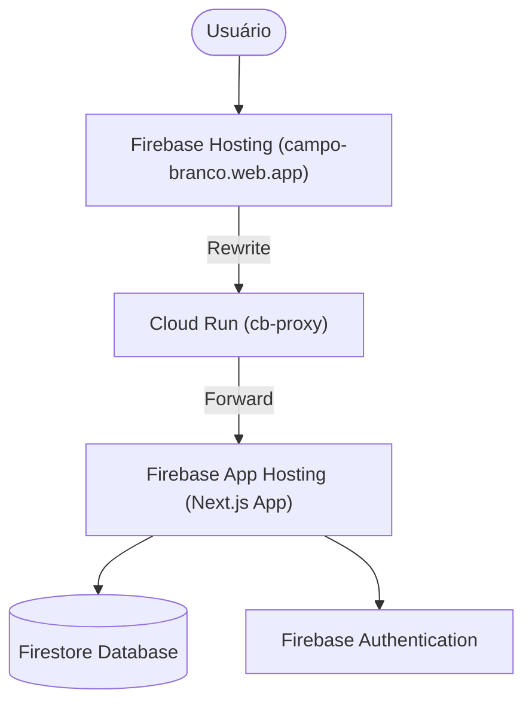

# Arquitetura do Sistema: Campo Branco

Este documento detalha a infraestrutura e a arquitetura técnica do projeto Campo Branco, servindo como guia para desenvolvedores e administradores do sistema.

## 1. Visão Geral da Infraestrutura

O sistema utiliza uma arquitetura híbrida baseada no **Google Cloud Platform (GCP)** e no **Firebase**, otimizada para performance (SSR), baixo custo e facilidade de deploy.

### 🌐 Fluxo de Requisição (Proxy Bridge)

Devido às limitações de URL personalizada do Firebase App Hosting, implementamos um proxy intermediário para manter a URL gratuita `.web.app` invisível para o usuário.

## 2. Componentes da Solução

### 2.1 Firebase Hosting (Frontend Roteador)
*   **Papel:** Porta de entrada e gestão de domínios.
*   **Configuração (`firebase.json`):** Contém regras de `rewrites` que direcionam todo o tráfego (`**`) para o serviço `cb-proxy`.
*   **CSP:** Define políticas de segurança rígidas para mitigar ataques XSS.

### 2.2 Cloud Run Proxy (`proxy-server`)
*   **Tecnologia:** Node.js + Express + `http-proxy-middleware`.
*   **Função:** Recebe requisições do Hosting e as encaminha para a URL interna do App Hosting.
*   **Importante:** Repassa cabeçalhos como `x-forwarded-host` para garantir que o Next.js reconheça o domínio original para fins de SEO e Autenticação.

### 2.3 Firebase App Hosting (Backend Next.js)
*   **Função:** Executa o aplicativo Next.js com suporte a Server-Side Rendering (SSR).
*   **Deploy:** Automatizado via integração com o GitHub (`campobranco/campobranco`).
*   **Configuração (`apphosting.yaml`):** Gerencia variáveis de ambiente e segredos (API Keys, Private Keys).

## 3. Segurança (CSP)

A segurança é reforçada em duas camadas:
1.  **`firebase.json`**: Cabeçalhos aplicados em nível de rede.
2.  **`middleware.ts`**: Cabeçalhos injetados dinamicamente pelo Next.js.

**Diretivas Principais:**
*   `script-src`: Permite Google APIs, Firebase e Leaflet (`unpkg.com`). Adicionado `blob:` para Service Worker.
*   `img-src`: Permite mapas (OpenStreetMap, CartoDB), Storage do Firebase e `blob:`.
*   `frame-src`: Necessário para o fluxo de login do Firebase.
*   `connect-src`: Inclui analytics e recursos dinâmicos do Leaflet/CartoDB.

## 4. Banco de Dados e Autenticação

*   **Firestore:** Banco NoSQL dividido em dois ambientes (`default` para produção e `campobrancodev` para desenvolvimento).
*   **Auth:** Utiliza Firebase Auth com suporte a domínios personalizados via proxy.

## 5. Manutenção e Deploy

### Repositórios
*   **Principal:** `https://github.com/campobranco/campobranco.git` (Contém o App e o Proxy).
*   **Landing Page (Estático):** `https://github.com/campobranco/campobranco.github.io.git` (Arquivos HTML antigos movidos para cá).

### Comandos Úteis
*   `firebase deploy --only hosting`: Atualiza regras de roteamento.
*   `gcloud run deploy cb-proxy --source .`: Atualiza o servidor de proxy (dentro da pasta `proxy-server`).

### Manutenção Periódica
- **Limpeza (Mar/2026)**: Remoção de arquivos `.bak`, `.log` e arquivos de dados temporários do root para manter o repositório limpo e organizado.

---
> [!IMPORTANT]
> Sempre que houver falha no deploy com erro `invoker_iam_disabled`, verifique se o Service Account `service-[PROJECT_NUMBER]@gcp-sa-firebaseapphosting.iam.gserviceaccount.com` possui a permissão `roles/run.admin`.

## 6. Migração para Plano Spark (Mar/2026)

Para eliminar custos e dependência de cartão de crédito, o sistema foi migrado para uma arquitetura **Static-First** compatível com o plano gratuito (Spark) do Firebase.

### 🔄 Mudanças Principais:
- **Remoção do Proxy:** Cloud Run (`cb-proxy`) e Firebase App Hosting foram descontinuados.
- **Static Export (SPA Mode):** O Next.js foi configurado com `output: 'export'`, gerando um bundle 100% estático (HTML/JS/CSS) na pasta `out/`.
- **Extinção do diretório `app/api/`:** Todas as rotas de API Node.js foram removidas e substituídas por serviços diretos.
- **Client-Side Logic:** Toda a lógica de servidor (Server Actions e API Routes) foi migrada para serviços de cliente (`lib/services/**`) utilizando o Firebase Client SDK (Firestore).
- **Gerenciamento de Admin:** Funções de administração (usuários, congregações, reparo de dados) agora operam via client-side, respeitando as Firestore Security Rules.
- **Zero Trust Security:** A segurança foi movida inteiramente para o **Firestore Security Rules**, validando permissões diretamente no banco de dados, sem intermediários de servidor.
- **Consolidação de Banco:** O uso de múltiplos bancos de dados foi removido, centralizando tudo no banco `(default)`.

### 🛠️ Novas Ferramentas e Serviços:
- **`lib/services/admin.ts`**: Centraliza gestão de usuários e congregações.
- **`lib/services/export.ts`**: Geração de CSV via Blob no navegador.
- **`sw-kill.js`**: Implementado para limpeza agressiva de caches antigos de PWA/Service Worker.
- **Versionamento**: O controle de versão (`package.json`) é o gatilho para invalidação de cache.

## 7. Instalação e Primeiro Acesso (Zero Configuration Admin)

Para facilitar deploys Open Source e novas instâncias do Campo Branco:
*   **Master Admin**: O primeiro acesso administrativo é definido pela variável `NEXT_PUBLIC_MASTER_EMAIL`.
*   **Promoção Automática**: Se o usuário logado corresponder a este e-mail, o `AuthContext` cria ou atualiza o perfil Firestore com o papel `ADMIN` automaticamente.
*   **Isolamento de Ambiente**: As credenciais de desenvolvimento (`campobrancodev`) e produção (`campo-branco`) são isoladas via arquivos `.env`, garantindo que testes locais não afetem dados reais.

---
### 📝 Registro de Melhorias:
- **[Mar/2026] Isolamento de Ambiente e Privacidade**: Removido `MEASUREMENT_ID` e centralizado o "Master Email" em variáveis de ambiente, resolvendo o problema de hardcoded emails e garantindo conformidade com a política anti-rastreamento.
- **[Mar/2026] Correções de Acesso e UX**:
  - Resolução do bloqueio de autenticação do Google Sign-In via adição do header de CSP `Cross-Origin-Opener-Policy: same-origin-allow-popups`.
  - Correção na permissão de criação e edição do próprio perfil no Firestore, corrigindo conflito e erro de **Missing or insufficient permissions**.
  - Ajuste na captura de log via `html2canvas` da imagem de avatar do Google, previnindo erro de rota 429 (Too Many Requests).
  - Remoção de obrigatoriedade do parâmetro `cityId` no serviço de estatísticas (`stats.ts`), liberando pesquisa e exibição de todos os cartões na listagem da página de cidades.
  - Mitigação de imagem de perfil (Google Avatar) corrompido no Next Export: `<Image>` alterado para `` com policy `no-referrer`.
  - v0.7.9-beta: Corrigido erro de permissão na exclusão de conta (Firestore rules).
  - v0.7.10-beta: Adicionada segurança extra na exclusão de conta, exigindo confirmação de e-mail e congregação.
- v0.7.11-beta: Corrigido erro de permissão para Publicadores em Listas Compartilhadas e Snapshots (Firestore rules).
- v0.7.12-beta: Refinada regra de atualização de Listas Compartilhadas para maior robustez com campos opcionais.
- v0.7.13-beta: Corrigida potencial recursão nas regras do Firestore e melhorada a performance de leitura do perfil.
- v0.7.14-beta: Padronização de campos (`assigned_to`) e correção da configuração de banco de dados no `.env.local`.
- v0.7.15-beta: Reversão do ID do banco de dados para `default` e simplificação das regras de permissão para aceitação de listas.
- v0.7.36-beta: Versão consolidada após atualizações manuais e sincronização com o GitHub.
- v0.7.37-beta: Correção do histórico do território (suporte a `congregationId` e `congregation_id` via `or()`).
  - Correção de erro de permissão na criação de listas compartilhadas: Adicionada regra para a coleção `shared_list_snapshots` e inclusão de `congregationId` nos documentos de snapshot para validação de segurança.
  - Substituição total do componente `<Image>` do Next.js por tags `` nativas em toda a aplicação (incluindo Login, Dashboard e Settings) para evitar conflitos de runtime com o construtor global `Image` do navegador.
  - Implementação de monitoramento em tempo real (`onSnapshot`) para o perfil do usuário no `AuthContext`, permitindo que alterações de papel (role) e congregação sejam refletidas instantaneamente na interface sem necessidade de recarregamento manual (Versão 0.7.0-beta).
  - Suporte resiliente a múltiplos formatos de campo para congregação (`congregationId` e `congregation_id`) no carregamento de perfil, garantindo compatibilidade com diferentes estados do banco de dados Firestore.
  - Sincronização e auditoria de segurança para o repositório GitHub, com proteção aprimorada no `.gitignore`.
  - [Mar/2026] Correção de Permissões no Dashboard:
    - Simplificação da função `belongsToUserCongregation` nas Firestore rules para suportar consultas de listagem e agregação de forma mais eficiente.
    - Substituição de `getCountFromServer` por `getDocs().size` no carregamento de estatísticas do Dashboard para garantir resiliência em consultas filtradas por congregação no plano Spark (Versão 0.7.1-beta).
    - Otimização radical de performance e permissões separando verificações de congregação em blocos OR. Os helpers `isSameCongregation` e `getCongId` agora lidam de forma robusta com variações de `camelCase` e `snake_case` nos documentos de usuário e recursos.
    - Correção crítica em `VisitsHistory.tsx`: inclusão de filtros explícitos de `congregationId` em consultas de ID (`documentId in chunk`), permitindo que usuários com papel PUBLICADOR visualizem nomes de usuários e endereços sem erro de permissão (Versão 0.7.2-beta).
    - [Mar/2026] Autonomia de Conta (v0.7.9-beta):
      - **Exclusão de Conta pelo Usuário**: Atualizada a regra de exclusão da coleção `users` para permitir que o dono do próprio perfil realize a deleção. Isso habilita a funcionalidade de "Excluir Minha Conta" nas configurações para usuários sem privilégios administrativos.
      - **Estabilização de Check-in (v0.7.8-beta)**: Simplificação de regras em `witnessing_points` para garantir funcionamento do check-in.
- v0.7.39-beta: Resolução do problema de "notificações fantasmas" através da padronização de consultas Firestore para suportar campos `camelCase` e `snake_case` (ex: `assignedTo` e `assigned_to`) simultaneamente usando o operador `or()`.
- v0.7.40-beta: 
  - Implementação do `MapSelectionModal` no `SharedListView.tsx`, permitindo que o usuário escolha entre Google Maps e Waze quando ambos os links estiverem disponíveis.
  - Otimização do histórico de mapas para territórios compartilhados, movendo a ordenação e filtragem para o lado do cliente para evitar a necessidade de índices compostos complexos no Firestore.
  - Correção de erro de sintaxe crítico no carregamento de endereços que impedia a visualização correta de cartões individuais.

---
> [!IMPORTANT]
> A partir da v0.6.183-beta, os arquivos `middleware.ts`, `apphosting.yaml` e a pasta `proxy-server/` tornaram-se obsoletos e devem ser removidos após validação.

