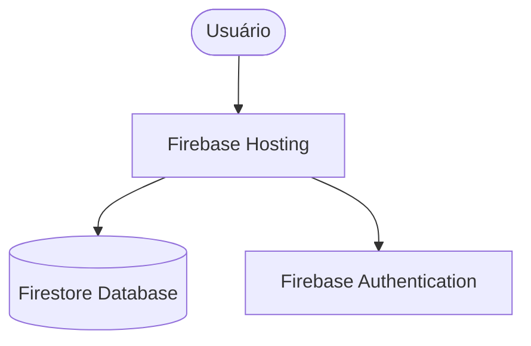

# Arquitetura do Sistema: Campo Branco

Este documento detalha a infraestrutura e a arquitetura técnica do projeto Campo Branco, servindo como guia para desenvolvedores e administradores do sistema.

## 1. Visão Geral da Infraestrutura

O sistema utiliza uma arquitetura híbrida baseada no **Google Cloud Platform (GCP)** e no **Firebase**, otimizada para performance (SSR), baixo custo e facilidade de deploy.

## 2. Estratégia de Ambientes e CI/CD

O sistema utiliza **GitHub Actions** para automação de deploy, segregando as instâncias por branch:

| Ambiente | Branch | URL Hosting | Projeto Firebase | Banco (Firestore) |
| :--- | :--- | :--- | :--- | :--- |
| **Local** | N/A | `localhost:3000` | `campobrancodev` | `campobrancodev` (Test) |
| **Staging** | `dev` | `campobrancodev.web.app` | `campobrancodev` | `campo-branco` (Prod) |
| **Produção** | `main` | `campo-branco.web.app` | `campo-branco` | `campo-branco` (Prod) |

### 2.1 Workflows
*   `staging.yml`: Disparado ao fazer push na branch `dev`. Realiza build com chaves de produção e deploy no ambiente de teste.
*   `production.yml`: Disparado ao fazer push na branch `main`. Realiza build e deploy completos em produção.

## 3. Componentes da Solução

### 3.1 Firebase Hosting
*   **Papel:** Porta de entrada e hospedagem de arquivos estáticos.
*   **Configuração (`firebase.json`):** Contém as regras de headers, CSP e redirecionamentos.
*   **Deploy:** Realizado via Firebase CLI (`firebase deploy`).

## 3. Segurança (CSP)

A segurança é reforçada em duas camadas:
1.  **`firebase.json`**: Cabeçalhos aplicados em nível de rede.
2.  **`middleware.ts`**: Cabeçalhos injetados dinamicamente pelo Next.js.

**Diretivas Principais:**
*   `script-src`: Permite Google APIs, Firebase e Leaflet (`unpkg.com`). Adicionado `blob:` para Service Worker.
*   `img-src`: Permite mapas (OpenStreetMap, CartoDB), Storage do Firebase e `blob:`.
*   `frame-src`: Necessário para o fluxo de login do Firebase.
*   `connect-src`: Inclui analytics e recursos dinâmicos do Leaflet/CartoDB.

## 4. Banco de Dados e Autenticação

*   **Firestore:** Banco NoSQL dividido em dois ambientes (`default` para produção e `campobrancodev` para desenvolvimento).
*   **Auth:** Utiliza Firebase Auth com suporte a domínios personalizados via proxy.

## 5. Manutenção e Deploy

### Repositórios
*   **Principal:** `https://github.com/campobranco/campobranco.git` (Contém o App e o Proxy).
*   **Landing Page (Estático):** `https://github.com/campobranco/campobranco.github.io.git` (Arquivos HTML antigos movidos para cá).

### Comandos Úteis
*   `firebase deploy`: Realiza o deploy completo (Hosting + Rules).
*   `npm run build`: Gera a versão estática do app.

### Manutenção Periódica
- **Limpeza (Mar/2026)**: Remoção de arquivos `.bak`, `.log` e arquivos de dados temporários do root para manter o repositório limpo e organizado.

---
> [!IMPORTANT]
> O projeto é 100% configurável via variáveis de ambiente. Verifique o arquivo `env.example` para as chaves necessárias.

## 6. Migração para Plano Spark (Mar/2026)

Para eliminar custos e dependência de cartão de crédito, o sistema foi migrado para uma arquitetura **Static-First** compatível com o plano gratuito (Spark) do Firebase.

### 🔄 Mudanças Principais:
- **Remoção do Proxy:** Cloud Run (`cb-proxy`) e Firebase App Hosting foram descontinuados.
- **Static Export (SPA Mode):** O Next.js foi configurado com `output: 'export'`, gerando um bundle 100% estático (HTML/JS/CSS) na pasta `out/`.
- **Extinção do diretório `app/api/`:** Todas as rotas de API Node.js foram removidas e substituídas por serviços diretos.
- **Client-Side Logic:** Toda a lógica de servidor (Server Actions e API Routes) foi migrada para serviços de cliente (`lib/services/**`) utilizando o Firebase Client SDK (Firestore).
- **Gerenciamento de Admin:** Funções de administração (usuários, congregações, reparo de dados) agora operam via client-side, respeitando as Firestore Security Rules.
- **Zero Trust Security:** A segurança foi movida inteiramente para o **Firestore Security Rules**, validando permissões diretamente no banco de dados, sem intermediários de servidor.
- **Consolidação de Banco:** O uso de múltiplos bancos de dados foi removido, centralizando tudo no banco `(default)`.

### 🛠️ Novas Ferramentas e Serviços:
- **`lib/services/admin.ts`**: Centraliza gestão de usuários e congregações.
- **`lib/services/export.ts`**: Geração de CSV via Blob no navegador.
- **`sw-kill.js`**: Implementado para limpeza agressiva de caches antigos de PWA/Service Worker.
- **Versionamento**: O controle de versão (`package.json`) é o gatilho para invalidação de cache.

## 7. Instalação e Primeiro Acesso (Zero Configuration Admin)

Para facilitar deploys Open Source e novas instâncias do Campo Branco:
*   **Master Admin**: O primeiro acesso administrativo é definido pela variável `NEXT_PUBLIC_MASTER_EMAIL`.
*   **Promoção Automática**: Se o usuário logado corresponder a este e-mail, o `AuthContext` cria ou atualiza o perfil Firestore com o papel `ADMIN` automaticamente.
*   **Isolamento de Ambiente**: As credenciais de desenvolvimento e produção são isoladas via arquivos `.env.development` e `.env.production`.

---
### 📝 Registro de Melhorias:
- **[Mar/2026] Isolamento de Ambiente e Privacidade**: Removido `MEASUREMENT_ID` e centralizado o "Master Email" em variáveis de ambiente, resolvendo o problema de hardcoded emails e garantindo conformidade com a política anti-rastreamento.
- **[Mar/2026] Correções de Acesso e UX**:
  - Resolução do bloqueio de autenticação do Google Sign-In via adição do header de CSP `Cross-Origin-Opener-Policy: same-origin-allow-popups`.
  - Correção na permissão de criação e edição do próprio perfil no Firestore, corrigindo conflito e erro de **Missing or insufficient permissions**.
  - Ajuste na captura de log via `html2canvas` da imagem de avatar do Google, previnindo erro de rota 429 (Too Many Requests).
  - Remoção de obrigatoriedade do parâmetro `cityId` no serviço de estatísticas (`stats.ts`), liberando pesquisa e exibição de todos os cartões na listagem da página de cidades.
  - Mitigação de imagem de perfil (Google Avatar) corrompido no Next Export: `<Image>` alterado para `` com policy `no-referrer`.
  - v0.7.9-beta: Corrigido erro de permissão na exclusão de conta (Firestore rules).
  - v0.7.10-beta: Adicionada segurança extra na exclusão de conta, exigindo confirmação de e-mail e congregação.
- v0.7.11-beta: Corrigido erro de permissão para Publicadores em Listas Compartilhadas e Snapshots (Firestore rules).
- v0.7.12-beta: Refinada regra de atualização de Listas Compartilhadas para maior robustez com campos opcionais.
- v0.7.13-beta: Corrigida potencial recursão nas regras do Firestore e melhorada a performance de leitura do perfil.
- v0.7.14-beta: Padronização de campos (`assigned_to`) e configuração de banco de dados via variáveis de ambiente.
- v0.7.15-beta: Reversão do ID do banco de dados para `default` e simplificação das regras de permissão para aceitação de listas.
- v0.7.36-beta: Versão consolidada após atualizações manuais e sincronização com o GitHub.
- v0.7.37-beta: Correção do histórico do território (suporte a `congregationId` e `congregation_id` via `or()`).
  - Correção de erro de permissão na criação de listas compartilhadas: Adicionada regra para a coleção `shared_list_snapshots` e inclusão de `congregationId` nos documentos de snapshot para validação de segurança.
  - Substituição total do componente `<Image>` do Next.js por tags `` nativas em toda a aplicação (incluindo Login, Dashboard e Settings) para evitar conflitos de runtime com o construtor global `Image` do navegador.
  - Implementação de monitoramento em tempo real (`onSnapshot`) para o perfil do usuário no `AuthContext`, permitindo que alterações de papel (role) e congregação sejam refletidas instantaneamente na interface sem necessidade de recarregamento manual (Versão 0.7.0-beta).
  - Suporte resiliente a múltiplos formatos de campo para congregação (`congregationId` e `congregation_id`) no carregamento de perfil, garantindo compatibilidade com diferentes estados do banco de dados Firestore.
  - Sincronização e auditoria de segurança para o repositório GitHub, com proteção aprimorada no `.gitignore`.
  - [Mar/2026] Correção de Permissões no Dashboard:
    - Simplificação da função `belongsToUserCongregation` nas Firestore rules para suportar consultas de listagem e agregação de forma mais eficiente.
    - Substituição de `getCountFromServer` por `getDocs().size` no carregamento de estatísticas do Dashboard para garantir resiliência em consultas filtradas por congregação no plano Spark (Versão 0.7.1-beta).
    - Otimização radical de performance e permissões separando verificações de congregação em blocos OR. Os helpers `isSameCongregation` e `getCongId` agora lidam de forma robusta com variações de `camelCase` e `snake_case` nos documentos de usuário e recursos.
    - Correção crítica em `VisitsHistory.tsx`: inclusão de filtros explícitos de `congregationId` em consultas de ID (`documentId in chunk`), permitindo que usuários com papel PUBLICADOR visualizem nomes de usuários e endereços sem erro de permissão (Versão 0.7.2-beta).
    - [Mar/2026] Autonomia de Conta (v0.7.9-beta):
      - **Exclusão de Conta pelo Usuário**: Atualizada a regra de exclusão da coleção `users` para permitir que o dono do próprio perfil realize a deleção. Isso habilita a funcionalidade de "Excluir Minha Conta" nas configurações para usuários sem privilégios administrativos.
      - **Estabilização de Check-in (v0.7.8-beta)**: Simplificação de regras em `witnessing_points` para garantir funcionamento do check-in.
- v0.7.39-beta: Resolução do problema de "notificações fantasmas" através da padronização de consultas Firestore para suportar campos `camelCase` e `snake_case` (ex: `assignedTo` e `assigned_to`) simultaneamente usando o operador `or()`.
- v0.7.40-beta: 
  - Implementação do `MapSelectionModal` no `SharedListView.tsx`, permitindo que o usuário escolha entre Google Maps e Waze quando ambos os links estiverem disponíveis.
  - Otimização do histórico de mapas para territórios compartilhados, movendo a ordenação e filtragem para o lado do cliente para evitar a necessidade de índices compostos complexos no Firestore.
  - Correção de erro de sintaxe crítico no carregamento de endereços que impedia a visualização correta de cartões individuais.
- v0.7.41-beta: Correção definitiva do Histórico de Território no `SharedListView.tsx`, garantindo que mapas ativos (em aberto) apareçam no histórico com status "Em andamento". Padronização de acesso a campos `assignedName`/`assigned_name` e suporte a objetos `Timestamp` do Firebase para resiliência na exibição de datas.
- v0.7.42-beta: Acesso Público total para links compartilhados. Ajustadas as `firestore.rules` para permitir leitura anônima de congregações, listas e visitas, além da criação (reporte) de visitas sem necessidade de login. O `SharedListView.tsx` foi adaptado para não exigir autenticação nas visualizações e permitir reportes anônimos.
- v0.7.43-beta: Redesenho do `gerenciar.bat` com interface visual (ANSI) e novas automações de build/deploy.
- v0.7.49-beta: Automação de `npm run build` antes de cada deploy no Gerenciador Web, garantindo que as variáveis de ambiente sejam aplicadas corretamente.
- v0.7.50-beta: Deploy dinâmico via `.env`. Removido Project ID fixo.
- v0.7.51-beta: Interface de Produção simplificada e remoção do `.firebaserc`.
- v0.7.52-beta: Reforço de estabilidade no servidor (Heartbeat e timeouts).
- v0.8.0-beta (O Grande Salto): Projeto transformado em Open Source e 100% Universal. Removidas todas as dependências de arquivos fixos e segredos do repositório. Identidade Visual, IDs de Projeto e URLs agora são 100% dinâmicos via `.env.production` e `.env.development`.
- v0.8.1-beta: Universalização de Elite. Dinamização completa de páginas legais e remoção de referências residuais a ambientes locais.
- v0.8.2-beta: Universalização Completa.
  - **Fim do Google Maps**: O componente `PointMap.tsx` foi migrado para **Leaflet**, removendo a última dependência de chaves pagas do Google. O projeto agora é 100% gratuito e open-source em geolocalização.
  - **Dinamismo de Marca**: O nome da marca (`NEXT_PUBLIC_APP_NAME`) e o e-mail de suporte (`NEXT_PUBLIC_SUPPORT_EMAIL`) agora são 100% dinâmicos em todas as páginas (Termos, Loading, Suporte).
  - **Limpeza de ENV**: Removidas referências obsoletas ao `.env.local` e `TARGET_URL` (Proxy). Unificação da `API_BASE_URL` diretamente no `next.config.js` para simplificar a manutenção.
  - **Padronização**: Arquivos `.env.development` e `.env.production` padronizados com a mesma estrutura e comentários.
  - **Segurança (COOP)**: Cabeçalho `Cross-Origin-Opener-Policy` migrado do `next.config.js` para o `firebase.json` para suportar Google Auth em exportações estáticas e eliminar alertas de build.
- v0.8.3-beta: Limpeza de Build e Estabilização de Hooks.
  - **Correção de Lint**: Resolvidos todos os avisos de `react-hooks/exhaustive-deps` em múltiplos arquivos (`Dashboard`, `Reports`, `Witnessing`, `MyMaps`).
  - **Uso de `useCallback`**: Funções de busca de dados foram estabilizadas para garantir reatividade correta e evitar loops de renderização infinitos ou avisos de build.
  - **Build 100% Limpo**: O processo de build agora é concluído com zero avisos de lint, garantindo maior qualidade de código e conformidade com as melhores práticas de Next.js/React.
- v0.8.4-beta: Ajuste de Segurança e Imagens.
  - **Correção de CSP**: Adicionado `lh3.googleusercontent.com` e `*.googleusercontent.com` à diretiva `img-src` no `firebase.json`. Isso resolve o bloqueio de exibição de fotos de perfil de usuários que fazem login via Google.
- v0.8.5-beta: Performance e Índices do Dashboard.
  - **Correção de Timeout**: Padronização dos campos de consulta de visitas de `visit_date` para `visitDate`, alinhando com a estrutura do banco e índices existentes.
  - **Novos Índices**: Adicionado índice composto para a coleção `shared_lists` (`congregationId` ASC, `createdAt` DESC), eliminando falhas de carregamento no histórico da congregação.
  - **Otimização de Hooks**: Revisão de dependências em `VisitsHistory` e `Dashboard` para evitar re-renderizações cíclicas que impactam a performance.
- v0.8.6-beta: Permissões e Resiliência de Dados.
  - **Correção de Permissões**: Adicionado filtro de `congregationId` ao listener de territórios para garantir sincronia com as regras de segurança do Firestore.
  - **Índice de Endereços**: Adicionado índice composto para `addresses` (`territoryId` ASC, `isActive` ASC) para suportar a contagem de endereços no carregamento de territórios.
  - **Resiliência**: Incluído tratamento de erro nos `onSnapshot` de territórios para evitar exceções não tratadas e melhorar o feedback ao usuário em caso de falha de permissão.
- v0.8.7-beta: Robustez e Compatibilidade Legada.
  - **Guarda de Autenticação**: Implementada verificação rigorosa de estado de autenticação em `territory/page.tsx` antes de qualquer leitura no Firestore, evitando erros de permissão no carregamento inicial.
  - **Índices Legados**: Expansão massiva de `firestore.indexes.json` para suportar queries em campos com nomenclatura antiga (ex: `congregation_id`) e nova (`congregationId`), garantindo funcionamento híbrido durante a transição.
  - **Limpeza de Projeto**: Remoção das pastas obsoletas `proxy-server/` e `docs/` para simplificar a estrutura do repositório Spark.
  - **Configuração de Domínio**: Reversão para `campo-branco.web.app` como domínio principal, mantendo `campobranco.web.app` como legado.
- v0.8.8-beta: Automação CI/CD e Ambientes Múltiplos.
  - **Múltiplos Ambientes**: Estabelecida regra de segregação onde `dev` atua como Staging (App Teste + Banco Prod).
  - **GitHub Actions**: Implementação de `staging.yml` e `production.yml` para deploys automatizados baseados em branches.
  - **Scripts de Deploy**: Adicionados comandos `deploy:staging` e `deploy:production` ao `package.json`.

## 🛠️ Gerenciador de Projeto (Instalador Visual Web)

Para facilitar o desenvolvimento e deploy, o projeto agora conta com uma interface web de gerenciamento.

### Como Usar:
1. Localize o arquivo `gerenciar.bat` na raiz.
2. Dê um duplo clique para iniciar.
3. O navegador abrirá automaticamente em `http://localhost:4000`.
4. Use a interface visual para:
   - **Instalar Dependências**: Executa `npm install`.
   - **Iniciar Servidor Dev**: Sobe o ambiente local.
   - **Build & Deploy**: Realiza o build e o deploy para PROD ou DEV.
   - **Sincronizar Regras**: Atualiza apenas as regras do Firebase.

---
> [!IMPORTANT]
> As pastas `proxy-server/` e `docs/` tornaram-se obsoletas e foram removidas para manter a simplicidade do projeto Spark.

