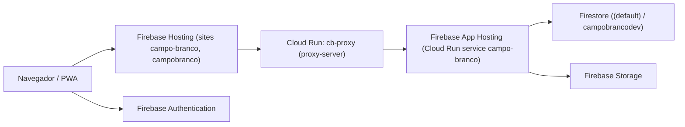

# Arquitetura e Configuração Atual - Campo Branco

## Objetivo
Este documento descreve a arquitetura e a configuração **como estão hoje** no repositório, com foco em orientar novos desenvolvedores sobre o funcionamento do sistema, seus principais módulos e o fluxo de deploy.

## Visão Geral do Sistema
O Campo Branco é uma aplicação web (PWA) construída com **Next.js 15 (App Router)** e **TypeScript**, hospedada no **Firebase App Hosting** com **Firebase Hosting** na borda e um **proxy em Cloud Run**. O backend é centrado no **Firestore** e na **Firebase Authentication**, com regras de segurança e isolamento por congregação.

Camadas principais:
- **UI/Frontend**: Next.js + Tailwind, páginas no `app/` (App Router).
- **Backend**: Route Handlers em `app/api/**/route.ts` e Server Actions em `app/actions`.
- **Persistência**: Firestore (duas bases), Storage e regras de segurança.
- **Infra**: Firebase App Hosting + Firebase Hosting + Cloud Run (proxy `cb-proxy`).

## Diagrama de Alto Nível


## Estrutura do Repositório
```
campobranco/
├── app/                 # App Router, rotas, pages e server components
├── components/          # Componentes UI reutilizáveis
├── lib/                 # Camada de serviços (Auth, Firebase, utilitários)
├── proxy-server/        # Proxy Cloud Run que encaminha para App Hosting
├── public/              # Assets estáticos e PWA (manifest, sw, ícones)
├── docs/                # Documentação
├── e2e/                 # Testes end-to-end (Playwright)
├── __tests__/           # Testes unitários e integração
├── firebase.json        # Config Firebase (Hosting, Firestore, Storage)
├── apphosting.yaml      # Config do App Hosting (Cloud Run + envs)
├── firestore.rules      # Regras de segurança do Firestore
├── storage.rules        # Regras de segurança do Storage
├── next.config.js       # Config do Next + PWA
└── package.json         # Scripts e dependências
```

## Configuração de Ambientes
### Projetos Firebase
Arquivo `.firebaserc`:
- `default`: `campo-branco` (produção)
- `dev`: `campobrancodev` (desenvolvimento)

### Variáveis de Ambiente
Arquivos locais:
- `.env` e `.env.local` para desenvolvimento
- `.env.production` para produção local
- `.env.example` como referência

App Hosting (`apphosting.yaml`) define as variáveis em build/runtime. Principais variáveis:
- `NEXT_PUBLIC_FIREBASE_*`: Client SDK do Firebase
- `NEXT_PUBLIC_FIREBASE_DATABASE_ID`: seleciona o banco (`(default)` ou `campobrancodev`)
- `NEXT_PUBLIC_ENVIRONMENT`: ambiente atual (`production`)
- `NEXT_PUBLIC_VAPID_PUBLIC_KEY`: chave pública VAPID (push)
- `FB_ADMIN_CLIENT_EMAIL` e `FB_ADMIN_PRIVATE_KEY`: credenciais do Admin SDK
- `VAPID_PRIVATE_KEY`: chave privada VAPID

Observação importante:
- **Sem `NEXT_PUBLIC_FIREBASE_DATABASE_ID`**, o código cai no **`campobrancodev`** por padrão (ver `lib/firebase.ts` e `lib/firebase-admin.ts`).

## Configuração do Next.js
Arquivo `next.config.js`:
- `output: 'export'` quando `GITHUB_ACTIONS=true` (suporte a GitHub Pages legado).
- `images` com `remotePatterns` para Google e Firebase Storage.
- `removeConsole` em produção.
- `NEXT_PUBLIC_API_BASE_URL` aponta para `https://campo-branco.web.app` em build do GitHub Actions.
- PWA habilitado via `@ducanh2912/next-pwa`, gerando Service Worker e Workbox.

## Infraestrutura e Deploy
### Firebase Hosting (`firebase.json`)
- Dois sites: `campo-branco` e `campobranco`.
- CSP e headers de segurança definidos globalmente.
- **Todas as rotas** são reescritas para o serviço Cloud Run `cb-proxy`.

### App Hosting (`apphosting.yaml`)
Configuração de Cloud Run:
- Região: `us-central1`
- Instâncias: `min=0`, `max=10`
- Concurrency: `80`
- CPU: `1`
- Memória: `1024 MiB`

### Proxy (Cloud Run)
Pasta `proxy-server/`:
- Express + `http-proxy-middleware`.
- Encaminha para a URL do App Hosting (ex.: `*.a.run.app`).
- Repassa `x-forwarded-host` para manter domínio de entrada.
- Service name: `cb-proxy` (alvo dos rewrites no Hosting).

### Fluxo de Requisição
1. Usuário acessa `campo-branco.web.app` ou `campobranco.web.app`.
2. Firebase Hosting aplica headers e redireciona tudo para `cb-proxy`.
3. `cb-proxy` encaminha para o App Hosting (Cloud Run do Next.js).
4. App Hosting executa as rotas Next.js e acessa Firestore/Storage.

## Camada de Aplicação (Next.js)
### Rotas e Páginas
Diretório `app/` (App Router) com páginas e layouts para:
- Admin, dashboard, reports, witnessing, settings, share, notifications, etc.

### Route Handlers (API)
Local: `app/api/**/route.ts`
Padrão: `app/api/<recurso>/<acao>/route.ts`
Exemplos:
- `territories`, `addresses`, `cities`, `visits`, `shared_lists`
- `admin` (congregations, users, migrações)
- `lgpd` (log de acesso e exclusão)

### Server Actions
Local: `app/actions/*`
- `geocoding.ts`: geocoding via Nominatim (server-side)
- `witnessing.ts`: CRUD de pontos de testemunho no Firestore

## Autenticação e Autorização
### Cliente (Browser)
Arquivo `lib/firebase.ts`:
- Inicializa Firebase Client SDK.
- Usa `browserLocalPersistence`.

Arquivo `app/context/AuthContext.tsx`:
- Escuta `onIdTokenChanged`.
- Salva o ID Token no cookie `__session` (necessário para SSR e API).
- Carrega perfil em `users/{uid}` e define papel (role).
- Permite simulação de papéis para ADMIN.

### Servidor (API/SSR)
Arquivo `lib/firebase-admin.ts`:
Ordem de credenciais:
1. Variáveis `FB_ADMIN_PRIVATE_KEY` + `FB_ADMIN_CLIENT_EMAIL`
2. ADC (em ambiente Google)
3. `service-account.json` local
4. Mock (se nada disponível)

Arquivo `lib/auth.ts`:
- Lê token via `Authorization: Bearer` ou cookie `__session`.
- Valida via Admin SDK.
- Cache LRU de perfis por 10 min.
- `requireAuth` aplica regras por role (`ADMIN`, `ANCIAO`, `SERVO`, `PUBLICADOR`).

## Persistência (Firestore)
### Bancos
Dois bancos configurados em `firebase.json`:
- `(default)` (produção)
- `campobrancodev` (desenvolvimento)

### Coleções Principais (observadas no código e regras)
- `users`
- `congregations`
- `cities`
- `territories`
- `addresses`
- `visits` (subcoleções)
- `shared_lists` e `shared_lists/items`
- `witnessing_points`
- `lgpd_logs`, `lgpd_requests`
- `security_logs`

### Regras de Segurança
Arquivo `firestore.rules`:
- Autenticação obrigatória na maioria das coleções.
- Isolamento por `congregationId`.
- Papéis hierárquicos: `ADMIN` > `ANCIAO` > `SERVO` > `PUBLICADOR`.
- Email master admin (`campobrancojw@gmail.com`) com acesso ampliado.

## Storage (Firebase Storage)
Arquivo `storage.rules`:
- `profiles/{userId}`: leitura/escrita apenas do próprio usuário.
- `public/*`: leitura pública, escrita apenas admin.
- Demais caminhos: bloqueados por padrão.

## Middleware (Edge)
Arquivo `middleware.ts`:
- Rate limiting em memória: **100 req/min por IP**.
- Proteção de rotas: `/admin`, `/witnessing`, `/reports`.
- Injeta headers de segurança (CSP, XSS, etc).
- Exclui assets e `_next/*` do matcher.

## PWA e Notificações
Arquivos relevantes:
- `public/manifest.json`: definição da PWA.
- `public/sw.js`: Service Worker gerado pelo PWA.
- `public/firebase-messaging-sw.js`: background notifications (FCM).

Pontos importantes:
- PWA é ativada pelo `next-pwa` e desativada em `NODE_ENV=development`.
- **Cache Buster Agressivo (v2)**: O `layout.tsx` detecta mudanças de versão via `localStorage`. Se a versão mudar, limpa todos os caches nomeados e desregistra Service Workers, forçando um reload total. Isso garante que novos cabeçalhos de CSP e assets entrem em vigor imediatamente.
- O layout limpa caches e registrações antigas de Service Worker para evitar versões obsoletas.

## LGPD e Auditoria
Arquivos:
- `lib/lgpd-registry.ts`: registra acessos e exclusões em `lgpd_logs` e `lgpd_requests`.
- `lib/security-logger.ts`: registra eventos críticos em `security_logs`.

## Testes e Qualidade
Scripts (`package.json`):
- `dev`, `build`, `start`, `lint`
- `test:unit` (Jest)
- `test:int` (Jest integração)
- `test:e2e` (Playwright)
- `test:all` (lint + unit + int + e2e)

## Pontos de Atenção para Novos Devs
- O cookie `__session` é **essencial** para SSR/API e é preenchido pelo `AuthContext`.
- O app pode rodar com **Admin SDK mockado** se variáveis de credenciais não forem definidas.
- A aplicação usa **dois bancos Firestore**. Verifique `NEXT_PUBLIC_FIREBASE_DATABASE_ID` antes de operar dados.
- O proxy `cb-proxy` é crítico: sem ele, o Hosting não encaminha corretamente para o App Hosting.

---

Última atualização: 2026-03-17
